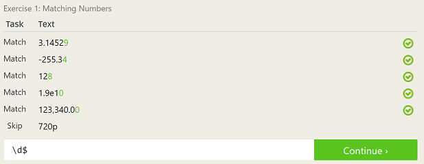
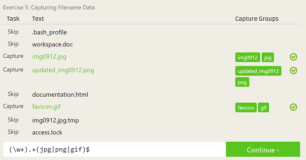

## Lab1
### Suggestions for How To Answer Questions in a Helpful Way 
  * Some instructions are hard to explain in words. Provide a picture or link to a video that can better describe the situation.
  * If a question has been asked elsewhere, provide a link to the previously asked question.

### Free Culture Chapter 3
  The chapter showed the important of open source softwares. Jesse improved an existing search engine for the benefit of everyone, 
  but his modifications were not welcomed. He was branded a pirate and claimed to violate copyright laws. Jesse didn't do anything 
  inherently wrong to deserve such treatment. Such copyright laws would prevent anyone to potentially improve existing technology. 
  If the search engine was an open source software, then any improvements to the programs would have been well received. Open source 
  softwares encourage such modifications for the better experience of everyone using the software. In addition, people with great ideas 
  like Jesse won't have to worry about legal issues when acting upon their ideas. 

### Tree
Tree Manual: 

Tree Directories:

### Regex
  
  
  
  
  
  
  

### Crossword
  
  
  
  

### Blocky Maze
  

### Open Source Project
An open source project that might be interesting to evaluate is Emacs. I use Emacs as my primary editor when programming, but I haven't really
gone in depth into what it is capable of. I know that Emacs is really powerful and would like to learn about what other things it
can do. Another open source project that might be interesting to evaluate is Notepad++. It is a simple editor with many useful features
like auto-complete based on other words in the file and highlighting keywords when editing a programming file. An addition that
would be interesting to see would be incorporating markdown, so it can recognize and highlight markdown symbols.