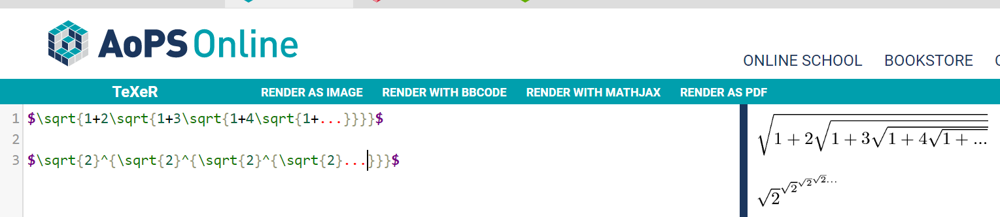
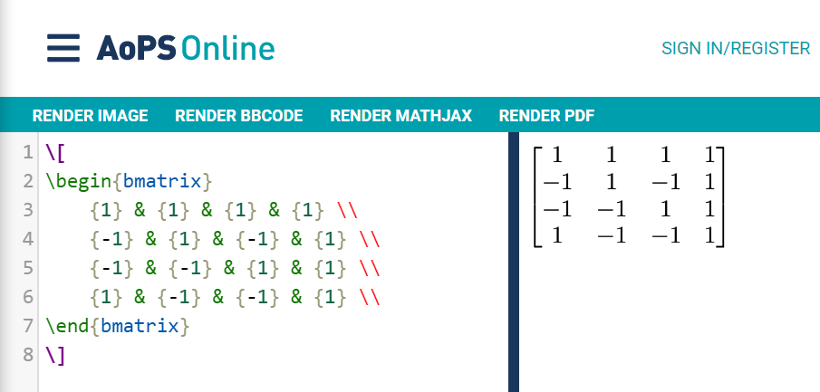

# Part 1
2. LaTeX Formula: 

3. LaTeX Matrix: 

# Part 2
## Open_IO

Number of contributors: 5

Number of lines of code: 277846

First commit: 

d99a79e633e9aa524d0994c419f9f1bb25e55f84 

"Initial commit" by gibboa on Mar 12, 2019

Latest commit:

5d6390cf3ddc5eb20f0cc7f7d542c87e1b8c0f42

"Merge pull request #46 from gibboa/zacknawrocki-patch-5" by gibboa on Apr 25, 2019

Current branches: zacknawrocki-patch-5, zacknawrocki-patch-4, zacknawrocki-patch-3, zacknawrocki-patch-2, zacknawrocki-patch-1

Gitstat: 

Gource: 

The number of authors listed by gitstats is higher than the number of contributers on GitHub. Also the number of lines on gitsats is less than the number of lines on GitHub.

## Organizer
4 Contributors

42703 lines total

db4084294c8bfb5b4f44238cf6f94cdf382cc7db -- First commit. 

"Initial Commit" by YLWS-4617 on Sept 11, 2018 on branch dummy

a07dbebd29ebfd899104b9ed30055ad1e23522d1 -- Last commit. 

"Fix: load static json file" by NeverBehave 23 days ago (May 15, 2019) on branch dummy

Current Branches: dev, dummy, master

## p5.js
64 Contributors
- 225319 Lines of Code
- First commit: 

	2bccc6c3d7184622419672d526db2bd35e46b6dd

	Author: Lauren McCarthy <laurmccarthy@gmail.com>

	Date:   Mon Feb 25 19:14:47 2013 -0800
    Initial commit  
- Latest commit: 

	commit 60deb1efba8593047d95091efeb5318150abc82f

	Author: Sanket Singh <24548786+sanketsingh24@users.noreply.github.com>
	
	Date:   Tue Mar 12 19:35:40 2019 +0530

	Feature: Implemented shininess() (#3489)

	* Implemented shininess()

	* Updated manual test example for shininess()

	* updated example for shininess()

	* Added changes from #3535

	* Modified example and minimum value for shininess()

	* Corrected docs for uShininess

	* added unit test for shininess

- There are 4 branches:
	- master
	- WebGL_GSOC17
	- webgl-gsoc-2018
	- p5.sound-0.3.10

The number of authors is different, gitstats lists 333, which is different than the number listed on GitHub
The number of lines is also different, gitstats reports 130660. 
Heres the total output:

[gitstats](https://github.com/shailpatels/oss-repo-template/blob/master/labs/lab-03/out/index.html)

## Petitions
### Contributors
7, including [petermikitsh](https://github.com/wtg/petitions/commits?author=petermikitsh) from the old repository.
### Lines of code
//TODO
To get the lines of a project, try something like git ls-files -z | xargs -0 wc -l in the cloned project directory
### First commit
[Commit](https://github.com/wtg/petitions/commit/fbd36a359ff9c6935013026f2048367f8b29a4c7)
### Latest commit
the current branches

## Phone Controllers
20477 lines  
4 contributors  
current branches: master
### first commit:  
User: Palmer-Stolly  
Title: "Initial commit"  
Date: January 22, 2019  
### latest commit: 
User: Palmer-Stolly  
Title: "not sure"  
Date: April 13, 2019  
### Gitstats
[gitstats](https://github.com/gwild37/oss-repo-template/blob/master/labs/lab-03/resources/outputpath/lines.html)  
The dates are the same, but the lines and authors are different. There are much fewer lines, and less contributors on gitstats. 
### Gource
[gource](https://www.youtube.com/watch?v=ORImAijAJdw)  
