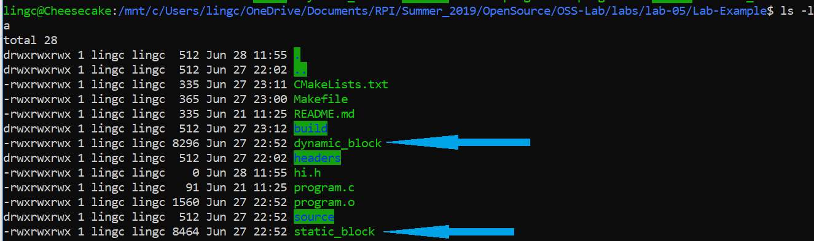

# Step 1
### Tutorial.cxx

### CMakeLists.txt

### Tutorial

# Step 2
### Tutorial.cxx 

### CMakeLists.txt

### Tutorial

For smaller numbers like 10, both sqrt and mysqrt give the same result.
For larger numbers like 4294967296, 
mysqrt does not produce the correct result while sqrt does.

# Step 3
### MathFunctions/CMakeLists.txt

### CMakeLists.txt

### Tutorial

# Step 4
### MathFunctions/CMakeLists.txt

### CMakeLists.txt

### Test Results
##### Test 1

##### Test 2-4

##### Test 5

# Step 5
### MathFunctions/CMakeLists.txt

### CMakeLists.txt

### Tutorial

Step1's sqrt and Step5's mysqrt gave the same results.

# Makefile
My Makefile: 
My CMakefile:
My Makefile created by cmake: 
Size of my executables:

Result of program: 
