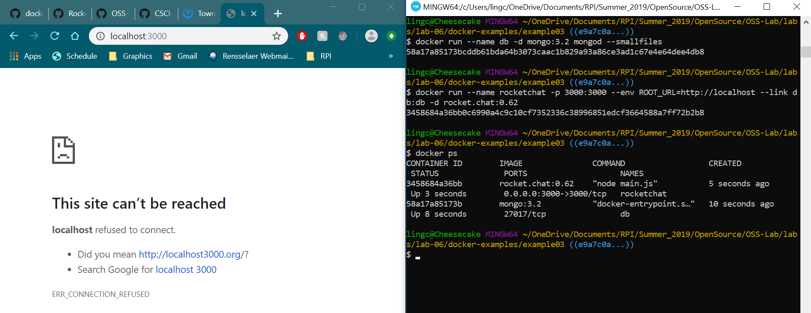

# Lab 6

## Example 0

## Example 1
### Running Ubuntu container

### Installing Vim

### Installing Cowsay

## Example 2
For example 2 I followed the instructions as written, including going 
back to a preivous version of rocket.chat, but I coun't get rocket.chat
to work. On the right, you can see 
that all the commands match the ones given and the container is 
running under "docker ps". However, on the left I have localhost:3000
open and it wouldn't connect. I have tried removing the containers 
and trying again many times, but it still didn't work.

## Example 3
For example 3 I couldn't get hello world to run on localhost:5000.
I followed the instructions in writing Dockerfile and ran the
docker commands, but nothing showed up in locahost:5000. 
In the image you can see the the commands are running, but 
localhost:5000 wouldn't connect.
### Dockerfile

### docker build

### docker run

## Example 4

